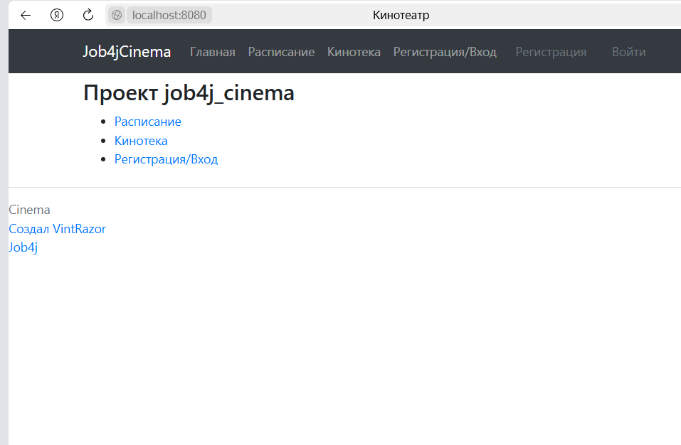

<h3>Общее описание</h3>

Это проект по разработке сайта покупке билетов в кинотеатр (один кинотеатр, а не сеть).
Наша задача написать только:

Регистрацию/Вход; 
Вывод киносеансов и фильмов; 
Покупку билетов. 

Для реализации использованы: 
- Spring Boot, 
- Thymeleaf, 
- Bootstrap, 
- Liquibase, 
- Sql2o, 
- PostgreSQL.
***
<h3>Представления:</h3>
- Главная страница выводит общую информацию о ресурсе; 
- Расписание. Выводит сеансы и связанные с ними фильмы. При выборе конкретного сеанса пользователь переходит
на страницу покупки билета; 
- Кинотека. Выводите список фильмов; 
- Страница покупки билета. Выводит информацию о сеансе и фильм. Также 2 выпадающих списка - один для указания ряда,
другой для указания места, и кнопки "Купить", "Отменить"; 
- Страница с результатом успешной покупки билета. Выводит сообщение пользователю,
"Вы успешно приобрели билет на место ..."; 
- Страница с результатом неудачной покупки билета (билет уже купили). Выводит, сообщение пользователю,
"Не удалось приобрести билет на заданное место. Вероятно оно уже занято. 
Перейдите на страницу бронирования билетов и попробуйте снова.".; 
- Страница регистрации.; 
- Страница входа. 

 ### Навигационная панель:
- Лого. При клике на него выполняется переход на главную страницу;

- Расписание. Выводит сеансы и связанные с ними фильмы;

- Кинотека. Выводите список фильмов, которые показываются в кинотеатре;

- Регистрация/Вход. Если пользователь не вошел в систему;
- Имя пользователя/Выйти. Если пользователь вошел в систему. 

Разделение прав: 
Все пользователи имеют право просматривать информацию на сайте; 
Только зарегистрированные пользователю могут покупать билеты. Если пользователь не зарегистрирован и нажимает на кнопку
"Купить билет", то его перебрасывает на страницу входа.

>Нюансы:
Все таблицы кроме таблицы tickets и users заполняются с помощью скриптов SQL.
> Подобные данные заполняются администратором, мы реализацию писать НЕ будем;

>Требования к окружению:  
> Java 17, Maven 3.8, PostgreSQL 14;

